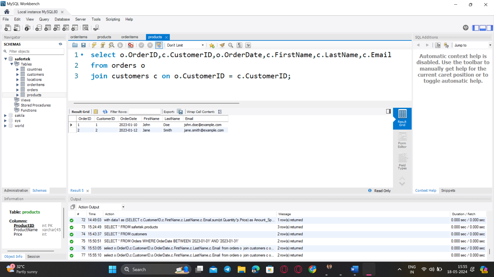
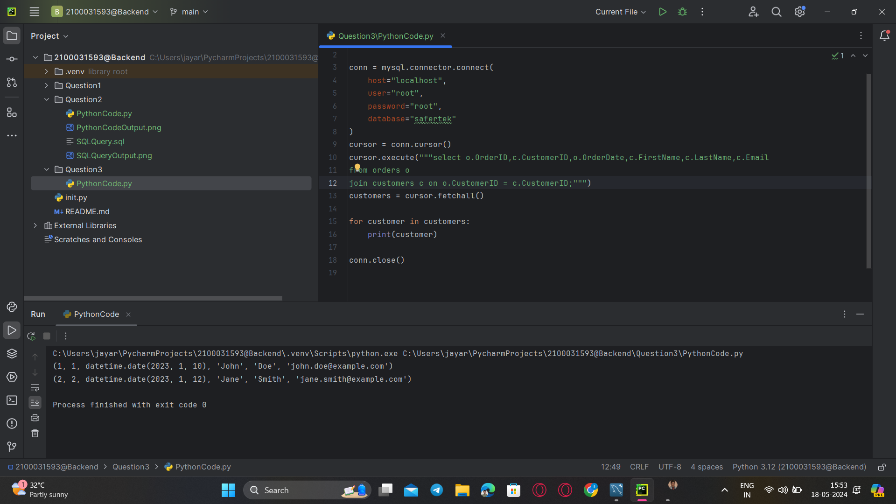

### **Question 3. Get the details of each order, including the customer name and email.**
Query:<br>
```sql
select o.OrderID,c.CustomerID,o.OrderDate,c.FirstName,c.LastName,c.Email
from orders o
join customers c on o.CustomerID = c.CustomerID;
```
<br>




