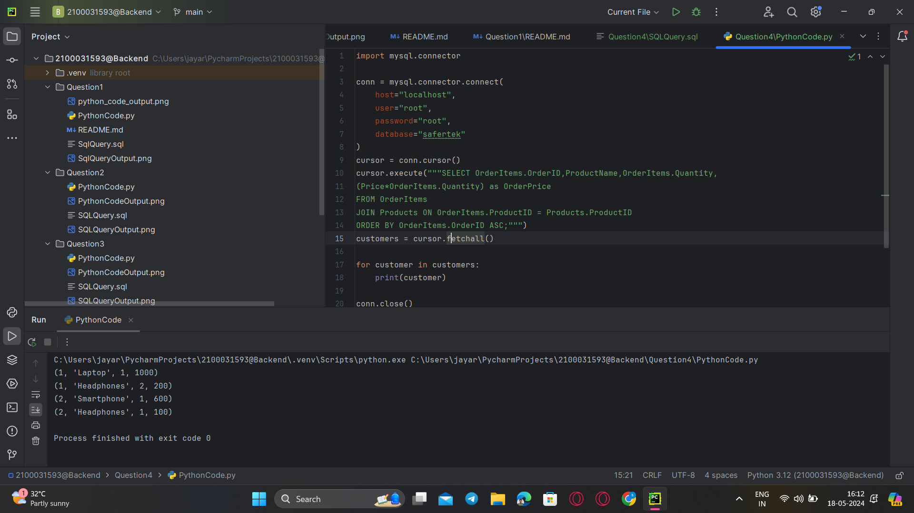

### **Question 4. List the products purchased in a specific order (e.g., OrderID = 1).**
Query:<br>
```sql
SELECT OrderItems.OrderID,ProductName,OrderItems.Quantity,
(Price*OrderItems.Quantity) as OrderPrice
FROM OrderItems
JOIN Products ON OrderItems.ProductID = Products.ProductID
ORDER BY OrderItems.OrderID ASC;

```
<br>



