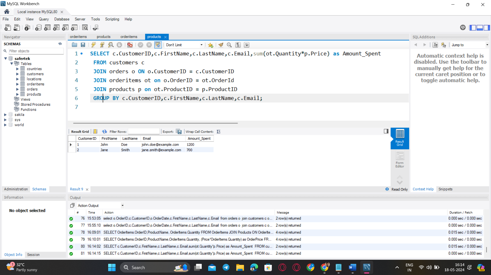
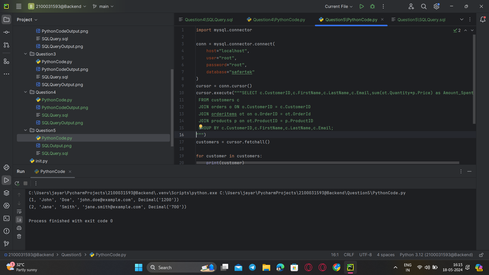

### **Question 5. Calculate the total amount spent by each customer.**
Query:<br>
```sql
SELECT c.CustomerID,c.FirstName,c.LastName,c.Email,sum(ot.Quantity*p.Price) as Amount_Spent
 FROM customers c
 JOIN orders o ON o.CustomerID = c.CustomerID
 JOIN orderitems ot on o.OrderID = ot.OrderId
 JOIN products p on ot.ProductID = p.ProductID
 GROUP BY c.CustomerID,c.FirstName,c.LastName,c.Email;
```
<br>




