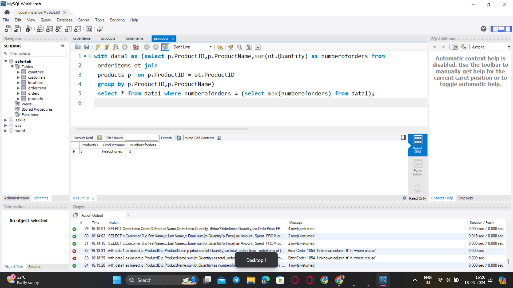

### **Question 6. Find the most popular product (the one that has been ordered the most).**
Query:<br>
```sql
with data1 as (select p.ProductID,p.ProductName,sum(ot.Quantity) as numberoforders from
 orderitems ot join
 products p  on p.ProductID = ot.ProductID
 group by p.ProductID,p.ProductName)
 select * from data1 where numberoforders = (select max(numberoforders) from data1);

```
<br>




