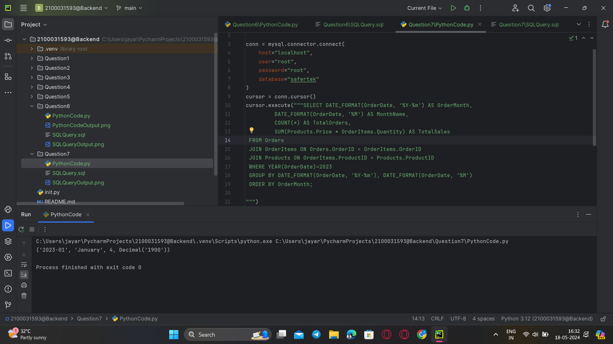

### **Question 7. Get the total number of orders and the total sales amount for each month in 2023.**
Query:<br>
```sql
SELECT DATE_FORMAT(OrderDate, '%Y-%m') AS OrderMonth,
         DATE_FORMAT(OrderDate, '%M') AS MonthName,
         COUNT(*) AS TotalOrders,
         SUM(Products.Price * OrderItems.Quantity) AS TotalSales
 FROM Orders
 JOIN OrderItems ON Orders.OrderID = OrderItems.OrderID
 JOIN Products ON OrderItems.ProductID = Products.ProductID
 WHERE YEAR(OrderDate)=2023
 GROUP BY DATE_FORMAT(OrderDate, '%Y-%m'), DATE_FORMAT(OrderDate, '%M')
 ORDER BY OrderMonth;

```
<br>



