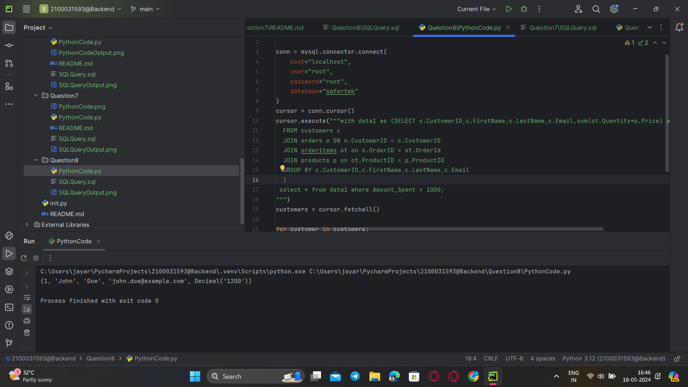

### **Question 8.Find customers who have spent more than $1000.**
Query:<br>
```sql
with data1 as (SELECT c.CustomerID,c.FirstName,c.LastName,c.Email,sum(ot.Quantity*p.Price) as Amount_Spent
  FROM customers c
  JOIN orders o ON o.CustomerID = c.CustomerID
  JOIN orderitems ot on o.OrderID = ot.OrderId
  JOIN products p on ot.ProductID = p.ProductID
  GROUP BY c.CustomerID,c.FirstName,c.LastName,c.Email
  )
 select * from data1 where Amount_Spent > 1000;

```
<br>



